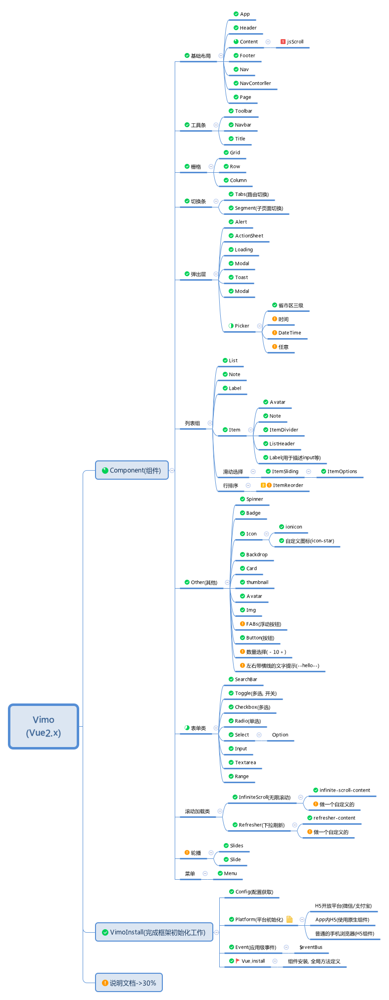

# Vimo
---

> 一套针对HyBrid平台开发的H5框架

## 框架解决的问题

使用一套H5代码在各类HyBrid平台中运行, 并根据平台完成对应的初始化工作, 且能根据平台自动切换主题样式.

可以使用的平台:  **微信、支付宝、钉钉、普通浏览器、原生App内部增强版WebView中**, 列如下图: 

.png)


## 如何开始

可以有两种方式使用: 

### npm安装
```
npm install vimo
```

### 使用startKit(推荐)

- [vimo-start-kit](https://github.com/DTFE/vimo-start-kit)

## 组件清单



## 框架技术清单(主要部分)

- vue 2.x
- vue-router 2.x
- webpack 2.x
- fastclick 1.x


## 版本信息

- 0.1.2 - 增加了转场动画及三级城市选择的picker组件
- 0.1.3 - 三级城市选择的picker组件debug, 增加微信初始化的代码
- 0.1.4 - 调整button组件
- 0.1.5 - 修复dom中的transitionEnd在打包中的问题
- 0.1.6 - 修复引用vimo后无法build的bug, 会因为源码为转为es5语法
- 0.1.7 - Navbar引入基础组件, Icon组件剔除对ionicons的依赖, 如果项目需要则自行安装`npm install ionicons`, 之后`import 'ionicons/dist/css/ionicons.css'`即可
- 0.1.8 - 修复`package.json`缺少依赖的问题
- 0.1.9 - platform增加onBridgeReady钩子, 平台初始化由platform自己完成, 其余的自定义部分由业务自己完成(比如: config配置, 分享配置等); 增加平台方法注册钩子`onBridgeReady`; 修复alert等组件的依赖关系.
- 0.2.0 - bridge设计完成(plt.registerMethod/this.$platform.do); searchbar/input组件debug; 明确基本组件为: App, Header, Footer, Content, Page, Nav, Button, Navbar, Toolbar, ToolbarTitle, ToolbarButtons, 其余按需加载.
- 0.2.1 - 去除refresher组件的console信息, 增加refresher-content组件的组件依赖.
- 0.2.2 - 修复modal打包后使用的bug
- 0.2.3 - 再次精简核心组件, 目前核心组件为: App/Nav/Page/Header/Content/Footer, 其余按需加载
- 0.2.5 - 弹出层组件优化实现逻辑. modal组件的onDismiss是在动画关闭后触发. 增加promise的polyfill. md模式下的button点击效果修复. actionsheet中button过多的显示bug修复. 修复城市三级联动组件无法正确显示三级的情况.
- 0.2.6 - 修复promise依赖的问题
- 0.2.7 - 城市三级组件修复页面切换不关闭的bug, platform组件debug
- 0.2.9 - 增加checkbox组件, 还未debug
- 0.3.0 - loading增加最长开启时间, 默认为5000ms(获取数据的最长时间)
- 0.3.1 - loading/actionsheet/alert组件随url变化而关闭. 增加select组件


